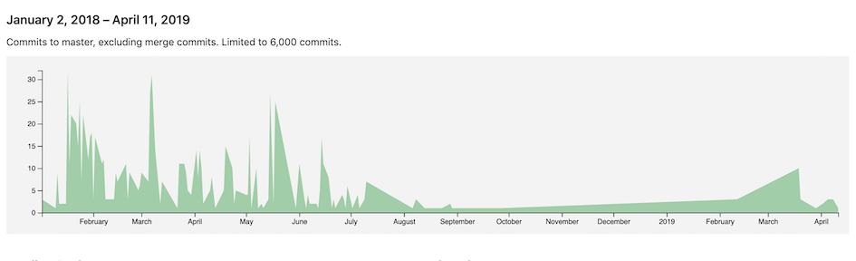

```{r setup, include=FALSE}
knitr::opts_chunk$set(echo = FALSE)
```

## Research bottleneck


```
        Source data --> ETL 
                            \
                           |Wrangle| --> Analytic data
                            /
        Research Qs  --> SAP
```

[Wrangle](https://www.merriam-webster.com/dictionary/wrangle)

1. to obtain by persistent arguing or maneuvering
2. [ back-formation from wrangler ] : to herd and care for (livestock and especially horses) on the range

## Existing solutions 

* Floors of SAS programmers 
* [aetion](https://www.aetion.com/platform) 
* [ConceptQL](https://github.com/outcomesinsights/conceptql) (Jigsaw)
* [ODHSI](https://www.ohdsi.org/)'s [ATLAS](http://www.ohdsi.org/web/atlas/#/home) program

## Early NoviSci ideas

* [Toward a Grammar of Study Design](https://confluence.novisci.com/display/PRBD/Toward+a+Grammar+of+Study+Design) (started 8/15/2017)
* [Towards a grammar of cohort construction and analysis](https://confluence.novisci.com/display/PRBD/Towards+a+grammar+of+cohort+construction+and+analysis) (started 12/15/2017)
* [cohort](https://gitlab.novisci.com/nsCohort/cohort) R package (inital commit 1/2/2018)
   * used in P0011, P0009, P0018, P0012, P0003



# What is a cohort?

## A Functional Cohort

$$
\Lambda: S \mapsto ( \zeta : P  \mapsto C )
$$
A *cohort planner* $\Lambda$ maps a specification $S$ to a *cohort builder* $\zeta$ which maps a population $P$ to a *cohort* $C$.

## The key ideas

* Express $S$ as a domain-specific language
* Carefully define the stucture of $P$
* Software does the rest

## Design goals

* [Domain-specific language](https://gitlab.novisci.com/nsCohort/asclepias/wikis/Domain-specific-languages) for cohort construction
   * mathematical foundation rather than either natural or computer language
   * "easy" for scientists to reason with
   * unambiguously parseable
   * lends itself to visual representation
* Software
   * built with concurrency and parallelism as first-order concerns
   * highly composable
   * provably safe (lives depend on this)

## Research Questions/Ideas

Based on the data types and functions, can we implement our most common and most complicated features drawn from the past year of NoviSci cohorts?

## Research Questions/Ideas

Can we develop a DSL that maps to the math from which scientists can write specifications for cohorts?

An [example of a DSL](http://docs.behat.org/en/v2.5/guides/1.gherkin.html):

```
Feature: Some terse yet descriptive text of what is desired
  In order to realize a named business value
  As an explicit system actor
  I want to gain some beneficial outcome which furthers the goal

  Scenario: Some determinable business situation
    Given some precondition
      And some other precondition
     When some action by the actor

  Scenario: A different situation
```

## Research Questions/Ideas

What GSL should be used to write the DSL?

* R
* Scala
* Haskell
* ...

## Research Questions/Ideas

Is the event-based data structure sufficient for deriving cohorts? What is effecient and tractable extract-transform process for mapping source data into event-based structure?

## Research Questions/Ideas

* Can a GUI or IDE be created for creating cohort specifications?
* Can a cohort specification directly generate the cohort description part of a SAP (rather then translating a protocol into a specification)?

# Early concepts

## Composition of data types

$$
\begin{array}{ll}
\text{population} \\
 P =  \{\{S_1, S_2, \dots\}, \square^P\} \\
 \text{subject} \; \downarrow  \\
 S_i = \{W_i, \square^S\}  \\
 \text{event history} \; \downarrow  \\
W_i = (w_1, w_2, \dots)  \\
\text{event} \; \downarrow   \\
w_k = \{\Xi, \square^{w_k}\}   \\
\end{array}
\quad
\begin{array}{ll}
\\  \\  \\  \\  \\
\stackrel{\mathcal{M}}{\longmapsto} \\ \\ \\
\end{array}
\quad
\begin{array}{ll}
\text{cohort}\\
C = \{\{U_1, U_2, \dots\}, \square^C\}  \\
\quad\quad\quad \uparrow \text{observational unit}\\
U_i = \{F_i, \square^U \}  \\
\quad\quad\quad \uparrow  \text{feature set}\\
F_i = \{f_1, f_2, \dots\} \\
 \quad\quad\quad \uparrow \text{feature} \\
f_j = \{\dots \}  \\
\end{array} 
$$
where $\mathcal{M}$ is the composition of functions that map event histories to features as specified by $S$. $\square^{\cdot}$ is a *context*, basically metadata about the object under consideration.

## Intervals

An event $w$ is composed of a *context* and an *interval*:

$$
\Xi := (a, b) \mid a \leq b \in \mathbb{Z}
$$

The domain of feature building functions is a sequence of events. In most cases, the interval is the key to computing the feature, while the context is used to filter to relevant events.